# AWS-VPC-Segmentation-and-EC2-Deployment-Lab

## Project Overview

This project demonstrates the design and implementation of a secure AWS network architecture using a custom Virtual Private Cloud (VPC). The lab focuses on network segmentation by creating separate public and private subnets, configuring routing, and deploying EC2 instances with different accessibility levels.

## Technologies
- AWS VPC
- EC2
- Internet Gateway
- Route Tables
- Security Groups

## Lab Tasks
- Created custom VPC (10.0.0.0/16)
- Created Public Subnet (10.0.1.0/24)
- Created Private Subnet (10.0.2.0/24)
- Attached Internet Gateway
- Configured Public & Private Route Tables
- Launched Public EC2 Instance
- Launched Private EC2 Instance
- Verified connectivity and network isolation

## Architecture

| Component | Configuration |
|-----------|--------------|
| VPC | 10.0.0.0/16 |
| Public Subnet | 10.0.1.0/24 |
| Private Subnet | 10.0.2.0/24 |
| Internet Gateway | Attached to VPC |
| Public Route Table | Internet access enabled |
| Private Route Table | Internal VPC communication only |
| Public EC2 Instance | Public & Private IP |
| Private EC2 Instance | Private IP only |

## Key Outcomes
- Successfully deployed a secure VPC architecture.
- Public EC2 instance received internet access through a public IP address.
- Private EC2 instance remained isolated from direct internet access.
- Demonstrated secure separation between public-facing and internal resources.

## Skills Demonstrated
- AWS VPC
- EC2
- Subnets
- Route Tables
- Internet Gateway
- Cloud Networking
- Cloud Security
- Infrastructure Deployment
- Network Segmentation

### 📊 Evidence 

<h4 align="center">In this step, I created a custom Virtual Private Cloud (VPC) named Idama-vpc-02</h4>

    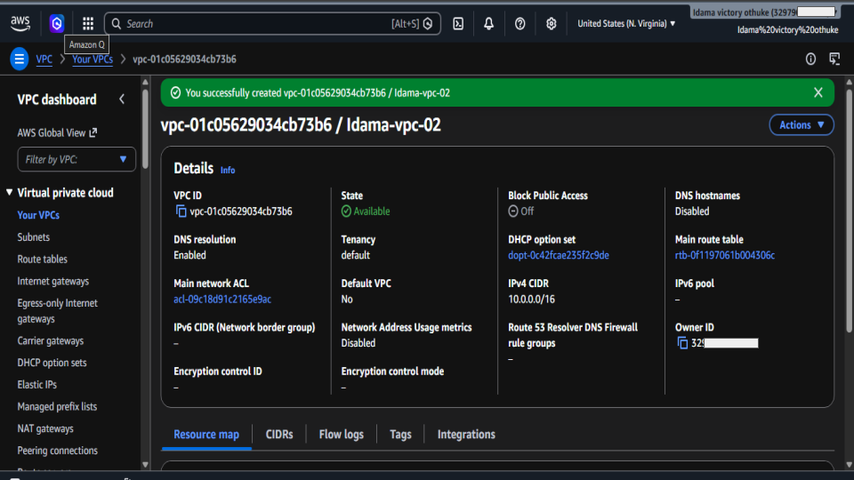

<h4 align="center">After successfully creating my custom VPC, the next step was to create a subnet within that network called Public-Subnet-1 and assigned it the CIDR block 10.0.1.0/24.</h4>

    

<h4 align="center">After creating the public subnet, the next step was to create a separate subnet called Private-Subnet-1 and assign it the CIDR block 10.0.2.0/24 </h4>

    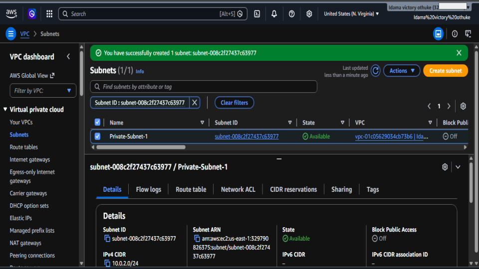

<h4 align="center">After creating both the public and private subnets, the next step was to create an Internet Gateway named victory-lab-igw.</h4>

    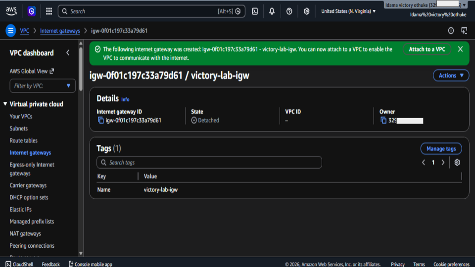

<h4 align="center">After creating the internet gateway i attached it to the VPC Idama-vpc-02.</h4>

    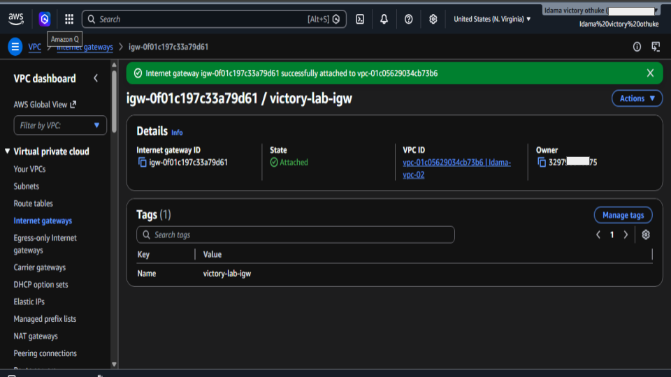

<h4 align="center">After creating and attaching the Internet Gateway to the VPC, the next step was to create a dedicated route table called public-rt.</h4>

    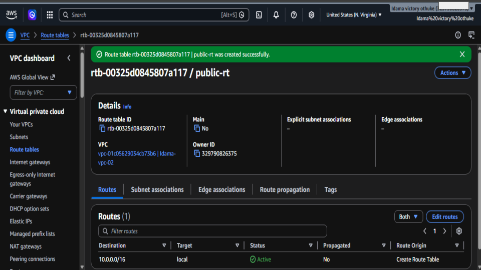

<h4 align="center">After creating the route table for the public subnet, the next step was to create a separate route table called private-rt for the private subnet</h4>

    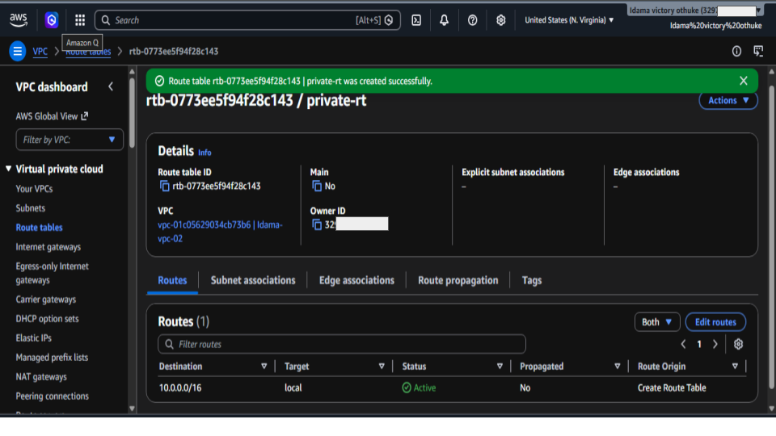

<h4 align="center">After creating both the public and private route tables, the next step was to associate the public route table (public-rt) with Public-Subnet-1.</h4>

    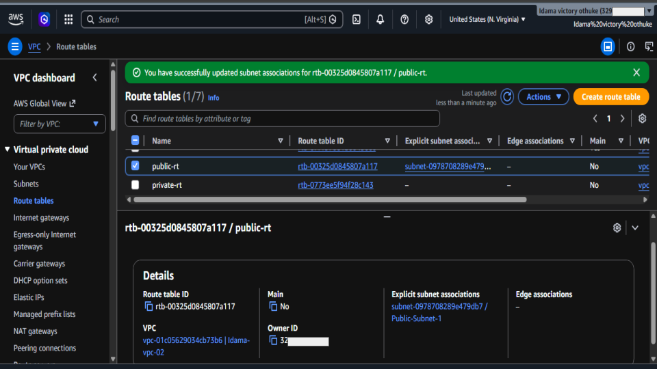

<h4 align="center">After associating Public-Subnet-1 with the public route table, the next step was to configure internet connectivity by updating the routing rules</h4>

    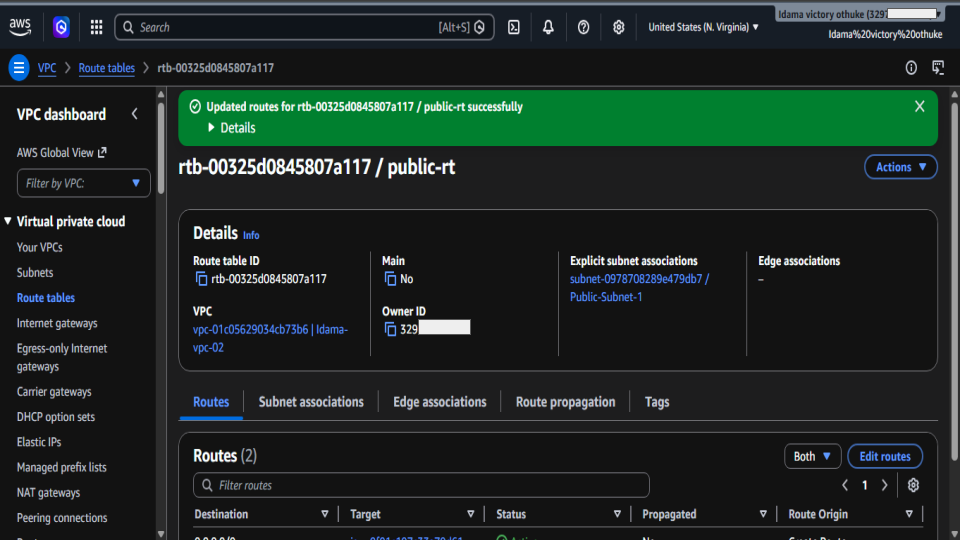

<h4 align="center">After configuring the VPC, subnets, Internet Gateway, and route table associations, the next step was to launch an EC2 instance within the Public-Subnet-1 network.</h4>

    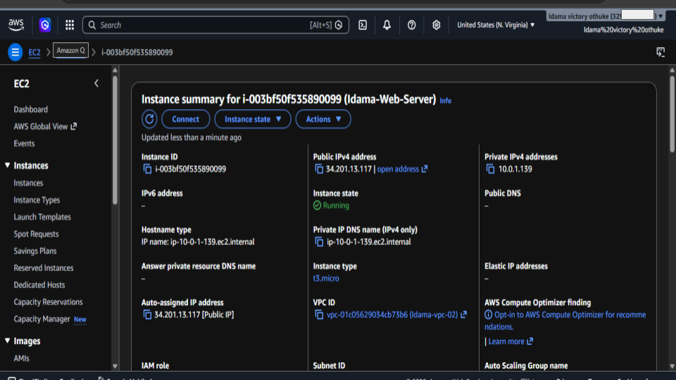

<h4 align="center">After successfully launching the EC2 instance and verifying that it received a public IP address</h4>

    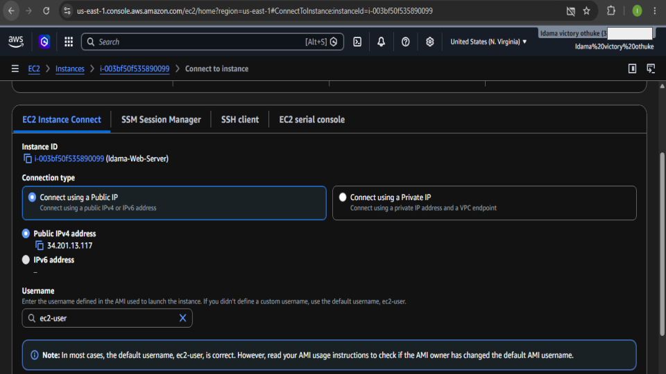

<h4 align="center">After successfully deploying and validating the public EC2 instance, the next phase of the project was to launch a second EC2 instance inside the Private-Subnet-1 network</h4>

    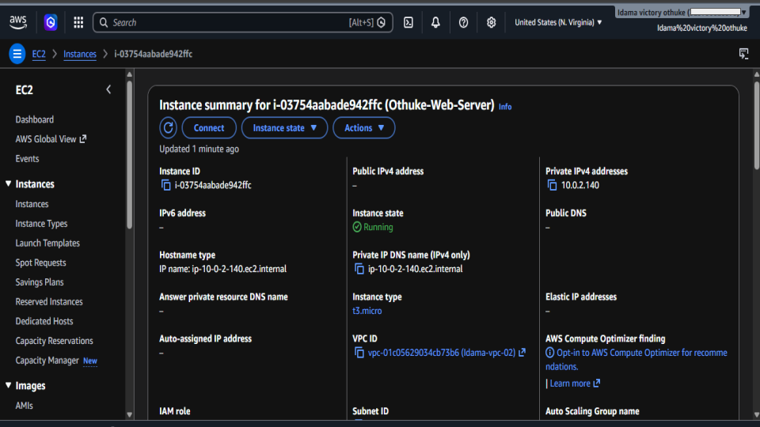

All screenshots are here:

🔗 [Google Slides](https://docs.google.com/presentation/d/1PTsfLE0iRndoaL2DQoSLSTcFkYdTfLfTNd5_jjpYThI/edit?usp=sharing)

> Note: Sensitive account information was blurred for security purposes before publication.

## Author
**Idama Victory Othuke**  
SOC Analyst | Cloud Security Engineer Enthusiast
